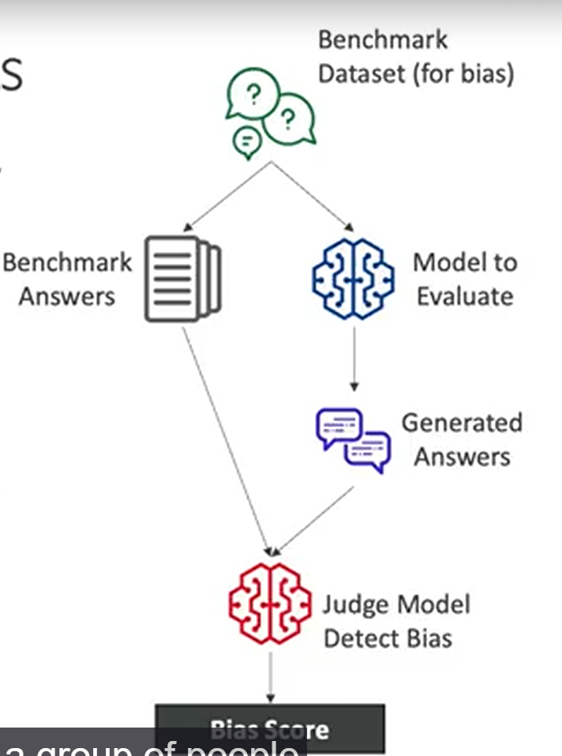

# Amazon Bedrock

Servicio de amazon que te permite utilizar foundation models para realizar aplicaciones.

Tiene features importantes como api disponible (invocación externa), RAG (el modelo no inventa la información, consulta data externa verídica y luego adapta su respuesta). (Fine tuning) Como punto importante, puedes entrenar tu propio modelo a partir de un foundation model disponible, realiza una copia de aquel FM a tu cuenta, manteniendo tu infomración segura.

> Tu información NO será utilizada para que amazon entrene a sus modelos.

## Foundation models

De todos los modelos, cuáles debería elegir, existen mas de 100, pero debes elegir en base a tus necesidades, al tipo (generador de imagen, texto, ...), capacidad del modelo, sus limitaciones, ...

El nivel de customización, hay modelos que permiten configurasr la temperatura, context windows, ...

> Amazon Titan: Foundation model from aws

Incluso, amazon te da la posibilidad de crear tus propios modelos custom, bajo una de las siguientes modalidades:

1. Reinforce learning (eliges un modelo y defines la funcion de ganancia)
2. Utilizas un modelo preentrenado y aplicas fine-tuning para ajustarlo
3. Distillation, Utilizas un modelo grande para crear uno mas pequeño y especializado

## Fine-tuning

Qué es? Adaptar un modelo fundacional para que realice una tarea específica.

> Los datos para el fine-tuning tienen que estar en un **S3** y en un formato en específico

Existen 2 tipos de fine-tuning:

- Supervised Fine Tuning: tienes que dar un input y un output para ajustar el modelo.
- Reinforcement Fine Tuning: Tienes que dar el input y una función que calcule el score del output. Si es un calculo objetivo, puedes realizar una funcion con Lambda. En cambio, si es subjetivo, puedes usar otro modelo para que te evalue la salida. (Ejemplo: Evaluar con un modelo, las salidas de un chatbot para ver si es empatico, efectivo, ...)

## Distillation

Reduces el tamaño de un modelo foundational, sacrificas accuracy (dentro de un rango aceptable) pero ahorras costo de rendimiento.

Cómo Funciona? Debes tener un modelo grande y potente, luego elaboras tu input data y generas los resultados de estos. Luego con esta entrada y la salida que se acaba de generar, se entrena un modelo supervisado.

## FM Evaluation

Como parte del proceso de uso de un foundational model, tenemos que aplicar técnicas para evaluar la calidad de las respuestas del modelo en cuestión. Para ello, Amazon tiene las siguientes alternativas:

### Automatic Evaluations

Se hará un banco de tareas (resumir texto, clasificación, pregunta-respuesta, ...) donde tendremos las respuestas correctas y las generadas por el modelo. Para luego utilizar otro modelo/función para evaluar el grado de similitud entre la respuesta correcta y la generada, y así evaluar numéricamente el modelo.

### Human Evaluations

Flujo casi igual al anterior, la única diferencia es el evaluador. En vez que un modelo/función evalúe la semejanza entre lo generado y lo correcto, la tarea lo realizarán personas.

### Métricas de evaluación (Intrínsecas)

Métricas que nos permiten evaluar internamente el funcionamiento del modelo

#### ROUGE (Recall)

Cuando se usa? Es usado frecuentemente para evaluar la calidad de resúmenes
Qué mide? Qué tanto contenido recuperas luego de realizar el resumen
Tiene problemas? No entiende el significado (trata sinónimos como si fuesen palabras distintas)

**Rouge N**: compara la cantidad de n-gramas entre la referencia y lo generado

| Referencia              | Generado     |
| ----------------------- | ------------ |
| el gato está en la casa | el gato está |

- Bigramas comunes: el gato, gato está
- Resultado: alto ROUGE, aunque el resumen esté incompleto

**Rouge L**: calcula la subsecuencia de palabras más larga entre la referencia y lo generado.

| Referencia                    | Generado             |
| ----------------------------- | -------------------- |
| el gato negro está en la casa | el gato está en casa |

- Subsecuencia común: el gato está en casa

#### BLEU (Precision)

Cuando se usa? Para realizar traducciones
Qué mide? Qué tan preciso para usar las mismas palabras/frases que la referencia (penaliza la brevedad)
Tiene problemas? No entiende el significado, penalizar traducciones con sinónimos

- Calcula combinaciones de ngramas (1, 2, 3, 4)

#### BERTScore

Qué mide? Analiza la similitud del significado de dos textos
Tiene problemas? Pesado y más lento que los otros tipos de métricas

#### Perplexity

> En la práctica real no se elige uno u otro, sino se suele utilizan combinadas.

### Métricas de evaluación (Extrínsecas)

Métricas que nos permiten evaluar extrinsicamente al modelo

| Métrica                  | Significado                                                                 |
| ------------------------ | --------------------------------------------------------------------------- |
| User Satisfaction        | Satisfacción del usuario                                                    |
| Average revenue per user | Promedio de dinero que suele gastar un usuario en un año (en mis productos) |
| Cross Domain Performance | Habilidad del modelo para realizar tareas de distintos ámbitos.             |
| Conversion Rate          | El porcentaje de usuarios que me visitan y se convierten en clientes.       |
| Efficiency               | Evaluar uso de cómputo, disco, recursos en general.                         |

## RAG and Knowledge Base
RAG o por sus siglas Retrieval Augmented Generation. 

Cuando quieras que tu modelo utilice información en específica que es de tu propiedad (llamada knowledge base) se utiliza esta técnica. Trata de tener una base de información en un formato en específico que el modelo utilizará como base para generar sus respuestas. 

El flujo inicia cuando el usuario crea un prompt, a lo que un modelo recepciona e inyecta/augmenta más información (texto) que es recogida del knowledge base teniendo como resultado un prompt completo. Para lo que otro modelo recepciona y genera el mensaje de respuesta.

El formato específico para aplicar RAG son los **Vector Database**, y para transformar la data se suele almacenarla en S3, luego se transforma en chunks (particiones) y luego se generarán embedding con algun modelo permitido (Amazon Titan, ...) para almacenarlo en un servicio de almacenamiento de vectores, tienes S3 Vectors, MongoDB, ...

Fuente de datos para alimentar tu **Vector Database** son S3, Confluence, SharePoint, Salesforce, Websites ...

## Guardrails

Se encarga de controlar y filtrar los request que se realizan al modelo fundacional. Usualmente es usado para filtrar contenido dañino, irrespetuoso, que no está en el alcance del modelo o data muy sensible como tarjetas de crédito ...

Ejemplo: Al chatbot de mercado libre le preguntas que puedes cocinar hoy, y te dice: eso no se, no fastidies xd.

